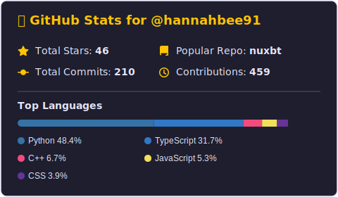

  <h1>Hi there 👋, I'm Hannah Brown</h1>
  
<em>Developer & DevOps Engineer based in Southern California (she/her)</em>

  
  

    
    
    
  

---

## 👩‍💻 About Me

I am Hannah and I like to break things and sometimes put them back together in the right order. I'm a mom, coffee lover, Zelda addict, rollerblader, and general goofball.

## 🛠️ Technical Skills

  
  
  
  
  
  
  

## 🏢 Work History

- **[Plume Health](https://getplume.co)** | Senior DevOps Engineer | *June 2021 - Present*
- **[Worthy Financial](https://worthybonds.com)** | Senior Backend Engineer | *November 2019 - June 2021*
- **[Shopper Approved](https://shopperapproved.com)** | Senior Developer | *April 2018 - November 2019*

---

## 📊 GitHub Stats

  

